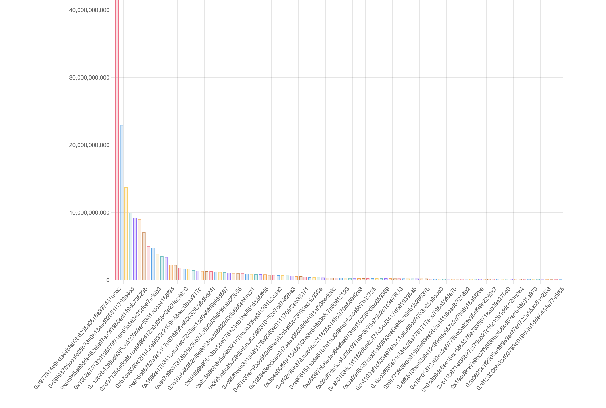
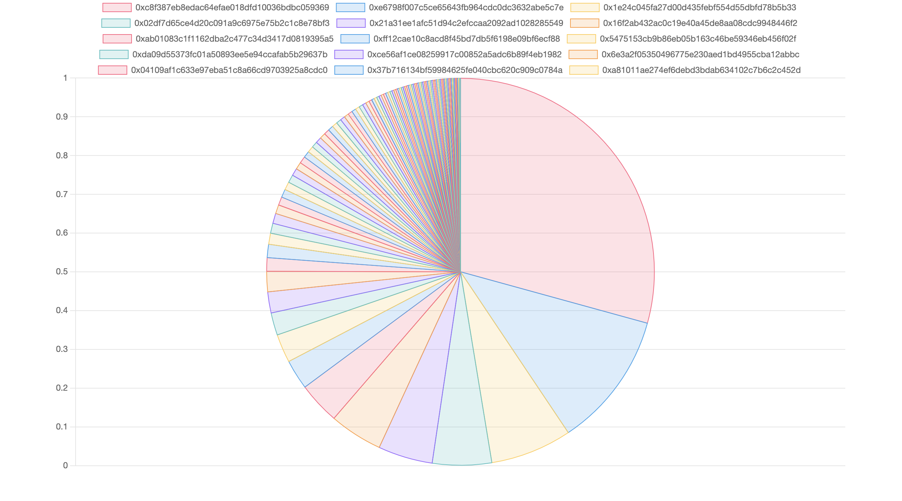
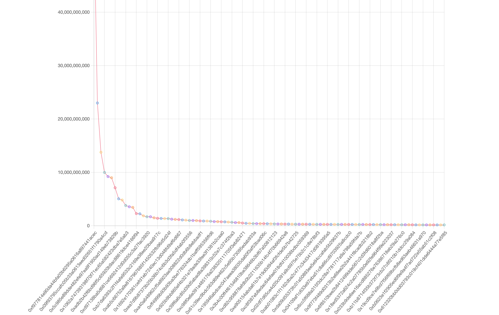
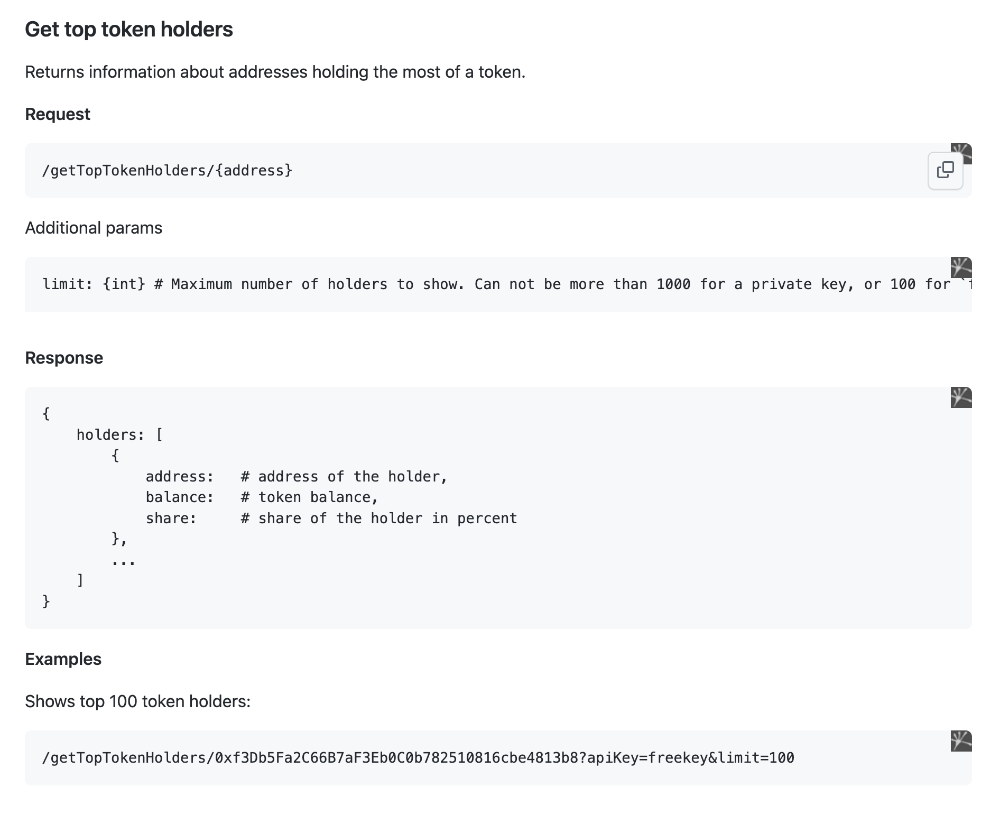

# Django Visualize Ethereum Address Assignment2

> This is Assignment 2 for advanced programming in python course 2.

## Installation

- From [github repository](https://github.com/kuroye/django_etherscan_assignment2).

## Usage

This program is a chart app that shows information about top addresses holding the most of a token with bar chart, pie chart and line chart.

## Examples

**Index page** `/`

***bar chart***

***pie chart***

***line chart***

**API from** `https://api.ethplorer.io`

`https://github.com/EverexIO/Ethplorer/wiki/Ethplorer-API#get-top-token-holders`
### License

Django Etherscan Assignment2 is [MIT LICENSE](./LICENSE)

